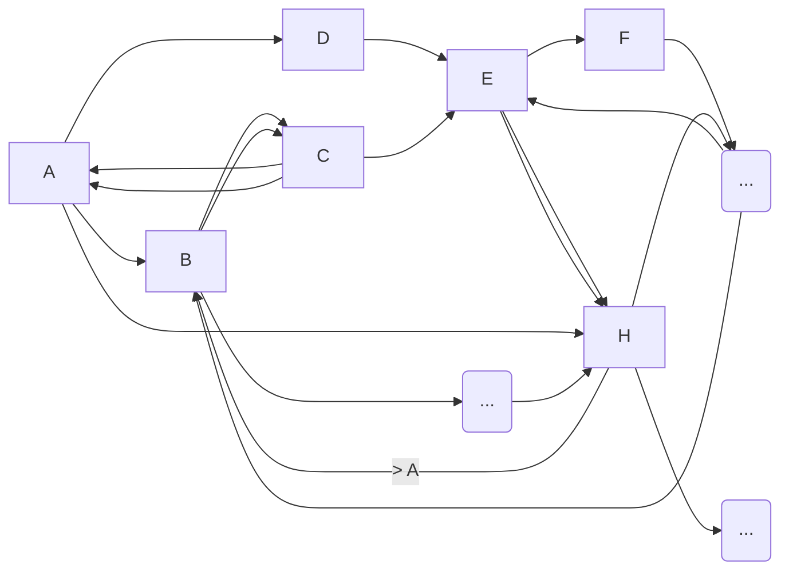
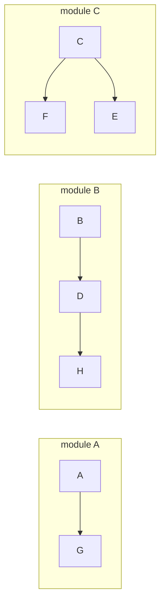

## 용어
네이버 사전을 검색해봤을때
* bounded : 경계가 있는, 칸막이 된
* context : 맥락, 전후사전
이렇게 검색이 된다.

말 그대로 해석하면 `경계가 있는 맥락` 정도로 해석하면 될꺼같음.

알아보기에 앞서 일딴 우리가 개발을 계속 해 나가다 보면 한가지 주제에대해서 기능이 계속 붙어나가고, 다른기능과 강한 결합을 맺게되기도하는데
그렇게 계속 붙여나가다보면 너무 거대해진다.

크릭에반스는 이런 경우를 거대한 진흙덩이라고 부른다.

이런 거대한 진흙덩이들을 맥락에 맞게 경계를 가지고자 정리를 한걸 바운디드 컨텍스트라고 볼수있다.

**`핵심되는 개념은 밀접하게 유지하고, 나머지는 제외`** 시키는게 바운디드 컨텍스트의 핵심 개념이라고 볼수있다.
