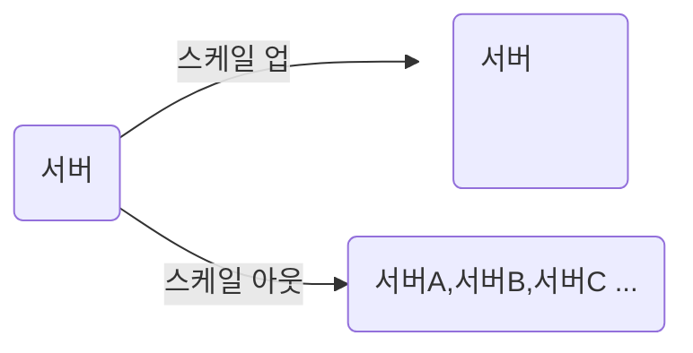

## 웹의 기본 아키텍처
---
~~~mermaid
flowchart TD

클라이언트:::A
웹서버:::A
웹_어플리케이션_서버:::A
데이터베이스:::A

classDef A fill:#fff
~~~

**웹서버**
- 정적인 데이터 처리
**웹 어플리케이션 서버**
- 동적인 데이터 처리

**강점**
1. 관심사의 분리
2. 관측가능한 시스템
3. 효율적인 리소스 사용

클라이언트는 무한정 늘어날수있는것에 반해
웹서버, 웹 어플리케이션 서버, 데이터베이스는 한정적임.

때문에 대용량 시스템의 경우 캐시나 비동기큐등의 다양한 기술들을 활용하게 됨.

## 스케일 업, 스케일 아웃
---

| |스케일 업|스케일 아웃|
|---|---|---|
|유지보수 및 관리|쉬움|여러노드에 적절히 부하분산 필요|
|확장성|제약이 있음|스케일 업에 비해 자유로움|
|장애복구|서버가 1대, 다운타임이 있음|장애 탄력성이 있음|

스케일 아웃을 하더라도 클라이언트 입장에선 하나의 서버를 바라보는 느낌을 받아야함.

어떤 서버에 호출을 해도 동일한 결과를 받아야함.

## 대용량 시스템
---
**대용량 시스템이 어려운 이유**
- 하나의 서버로 감당하기 힘들어 대부분 여러개의 서버 또는 데이버베이스를 사용함
- 여러개의 서버에 유입되는 데이터의 일관성을 보장할 수 있어야 함
- 코드 한줄이 데이터에 미치는 영향범위가 굉장히 커짐
- 여러 서비스들이 얽혀있어, 시스템 복잡도가 상당히 높음

**대용량 시스템 필수 조건**
- **고가용성**
	- 언제든 서비스를 이용할 수 있어야 한다
- **확장성**
	- 시스템이 비대해짐에 따라 증가하는 데이터와 트래픽에 대응할 수 있어야한다.
- **관측가능성**
	- 문제가 생겼을 때 빠르게 인지할 수 있어야 하고 문제의 범위를 최소화 할 수 있어야 한다.