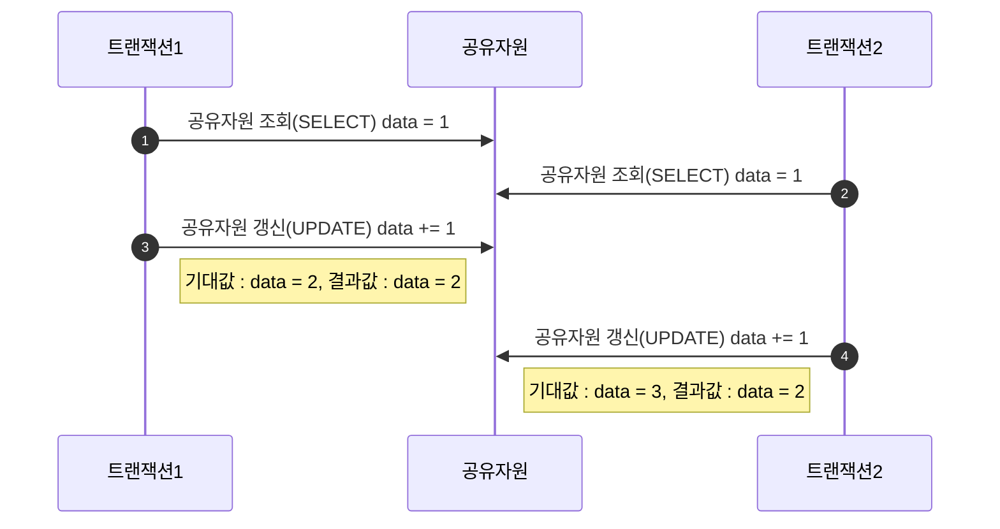

## 멀티스레드 환경
---
동시성 이슈가 발생하는 일반적인 패턴

1. 공유자원 조회
2. 다른 트랜잭션이 공유자원 조회
3. 공유자원 갱신
4. 다른 트랜잭션 공유자원 갱신
5. 읭?! 결과가 이상하다?!!?!




해결 : 공유자원에 대한 잠금을 획득하여 줄 세우기


| |읽기락(Shared Lock)|쓰기락(Exclusive Lock)|
|---|---|---|
|읽기락(Shared Lock)|O|대기|
|쓰기락(Exclusive Lock)|대기|대기|


### 비관적 락
---
기본적으로 트랜젝션이 충돌할것이라고 비관적으로 생각하고 락을 걸어둠

`SELECT ~ FOR UPDATE`
- 데이터를 UPDATE 하기위해 SELECT 한거라고 표현해줌으로 베타적 Lock을 걸어둔다.
- 순차대로 처리하게됨.
- 따라서 데이터 무결성 보장하는 수준은 높지만 동시성이 떨어지기때문에 손해가 크다.

### 낙관적 락
---
트랜잭션이 충돌하지 않을거라고 생각하고 진행

- 데이터베이스가 제공하는 락 기능을 사용하지않고 애플리케이션이 제공하는 락
- version으로 상태를 관리하고 충돌이 확인되면 롤백 진행
- 동시요청 처리 성능은 좋지만 충돌시 롤백이 일어나서 손해가 큼

### 레코드 락
---
MySql InnoDB는 인덱스 락을 건다.
예를들어
```SQL
/*city 컬럼에 인덱스 설정되어있다고 가정*/
SELECT COUNT(*) FROM user WHERE city = 'seoul' -- 1000건 조회

SELECT COUNT(*) FROM user WHERE city = 'seoul' AND nick_name = 'LHJ' -- 1건 조회

UPDATE user SET phone = '01012345678' WHERE city = 'seoul' AND nick_name = 'LHJ'
```
해당 업데이트 쿼리를 날리면 실제 업데이트 되는건 한건이지만 city = 'seoul' 조건에 해당하는 1000건에 락이 걸린다.

### 갭 락
---
인덱스 사이사이 비어있는 레코드에 락을 건다.
예를들어
|id|nick_name|
|---|---|
|3|lhj|
|7|java_holic|
|10|cpp|

이런 테이블이 있을때
- id < 3
- 3 < id < 7
- id < 10
이 부분이갭이고 이러한 갭에 락이 걸린다.

```SQL
SELECT id FROM table WHERE id BETWEEN 5 AND 15 FOR UPDATE;
```

이런경우, `5 <= id < 7`, `7 < id < 10`, `10 < id <= 15`는 락에 걸린다.


### 넥스트 키 락
---
쉽게 생각해서 래코드 락과 갭 락이 같이 적용됐다고 보면 됨.


### 데드락
---
서로 무한 대기중인 상황


### 외래키로 인한 잠금
---
외래키는 부모테이블이나 자식 테이블에 데이터가 있는지 체크하는 작업이 필요하므로 잠금이 여러 테이블로 전파되고, 그로인해 **데드락**이 발생할 수 있다. 그래서 실무에서는 잘 사용하지 않는다.

1. **자식테이블**이 대기하는 경우
- 부모테이블이 잠가두고있으면 자식테이블의 외래키 변경시 대기한다.
- 외래키가 아닌 경우는 잠금 확장이 발생하지 않음
2. **부모테이블**이 대기하는 경우
- 자식테이블 갱신중일때 부모테이블을 삭제 못함.(ON DELETE CASCADE)

이처럼 영향을 받음


